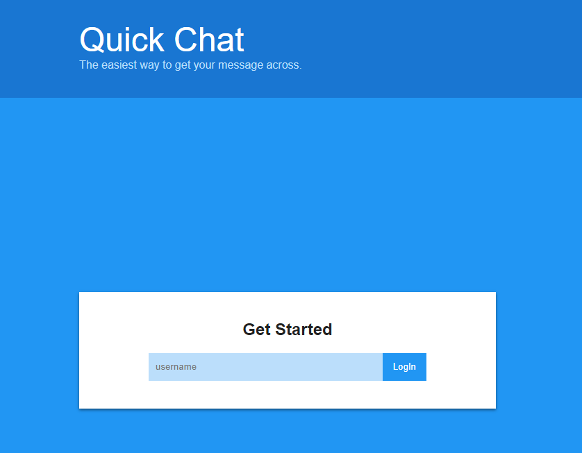
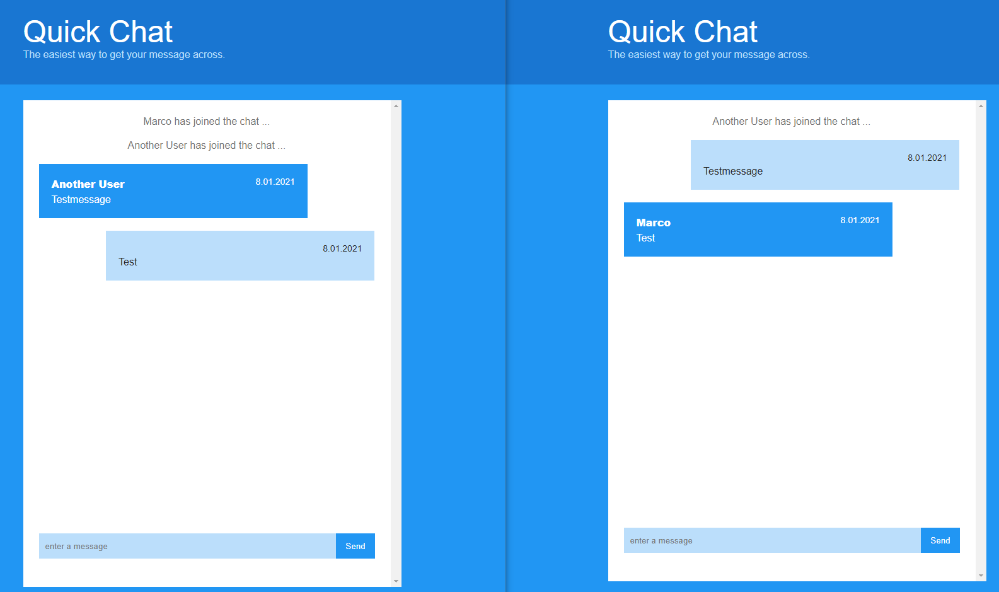

# Design and Build a Chat App with Socket.io

I was looking for some hands-on practice and saw [@christianp86](https://github.com/christianp86) starring this wonderful [project](https://github.com/jamesqquick/Design-and-Build-a-Chat-Application-with-Socket.io) of [James Q Quick](https://github.com/jamesqquick). So I followed it along and learned as well as refreshed a few things here and there. I've never been the CSS guy and I sometimes lack imagination in order to create something from scratch, so this was perfect. Not to mention the free tips on [emmet abbreviations](https://docs.emmet.io/abbreviations/) and [vsc code snippets](https://code.visualstudio.com/docs/editor/userdefinedsnippets) Check out the YT-Playlist linked below!

### Overview (Login)



### Overview (Chat)



### VSC Code Snippets
```json
{
    "Get Element by id": {
        "prefix": "getid",
        "body": "const $1 = document.getElementById('$1');\n$0",
        "description": "Gets DOM element by id"
    },
    "Get Elements by class": {
        "prefix": "getclass",
        "body": "const $1 = document.getElementsByClassName('$2');\n$0",
        "description": "Gets DOM elements by classname"
    },
    "Get Element by query selector": {
        "prefix": "getel",
        "body": "const $1 = document.querySelector($2);\n$0",
        "description": "Gets DOM element by query selector"
    },
    "Get Elements by query selector": {
        "prefix": "getels",
        "body": "const $1 = document.querySelectorAll($2);\n$0",
        "description": "Gets DOM elements by query selector"
    }
}
```

### Tutorial series by

* [James Q Quick](https://www.youtube.com/c/JamesQQuick)
* [YT-Playlist](https://www.youtube.com/playlist?list=PLDlWc9AfQBfbyGwhSlxg16mQGpGnauCwq)
* [Original Repository](https://github.com/jamesqquick/Design-and-Build-a-Chat-Application-with-Socket.io)
